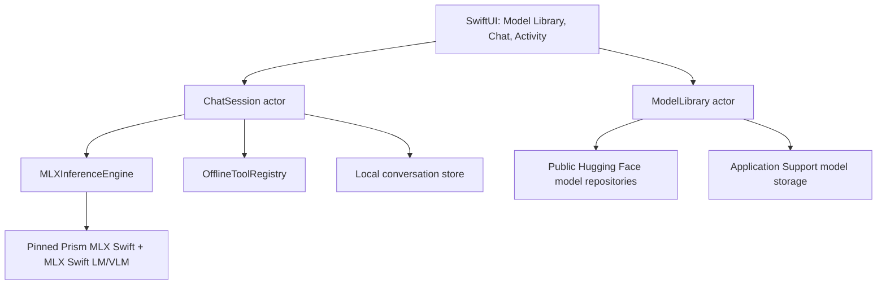
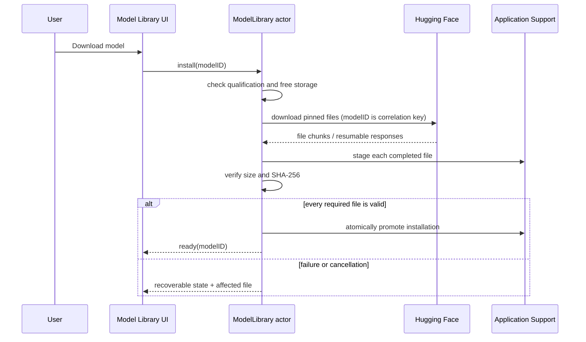
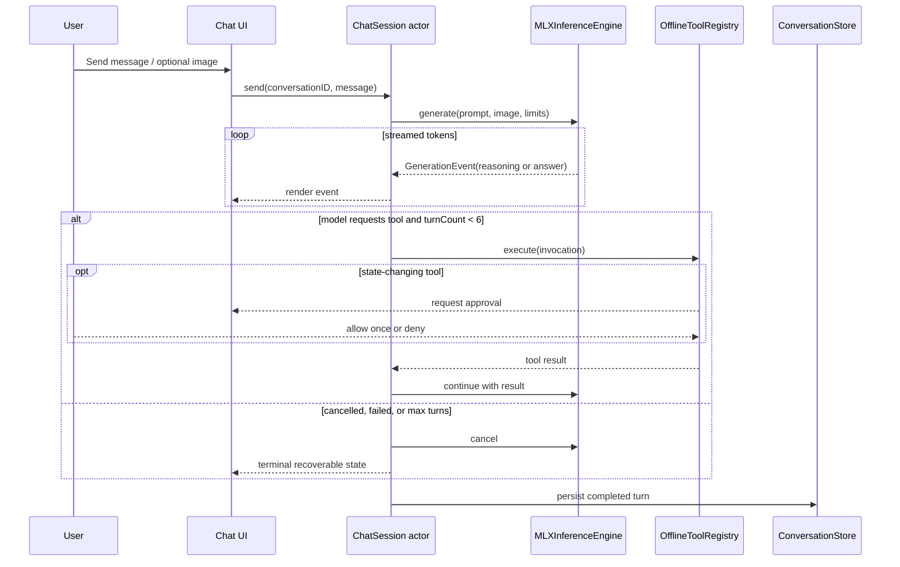

# Bonsai Mobile design

## Overview

Bonsai Mobile is a universal SwiftUI agent-chat application for iPhone, iPad,
and Mac. It downloads or imports public Prism model packs, performs all
inference locally through Prism's MLX Swift runtime, supports vision and a
bounded offline tool loop, and never falls back to cloud inference.

The 1-bit Bonsai-27B model is the phone-class path. Ternary-Bonsai-27B is
available only on verified, high-memory iPad and Mac configurations. The app
runs on iOS/iPadOS 17 and macOS 14 or newer even when the current device cannot
run either model; in that case it explains the limitation without attempting an
unsafe model load.

## Standards Check

- Canonical repository sources checked: `AGENTS.md`, `README.md`, `VISION.md`,
  and `TOOLS.md`.
- Canonical external sources checked:
  [Bonsai 27B collection](https://huggingface.co/collections/prism-ml/bonsai-27b),
  [1-bit MLX model card](https://huggingface.co/prism-ml/Bonsai-27B-mlx-1bit),
  [Ternary MLX model card](https://huggingface.co/prism-ml/Ternary-Bonsai-27B-mlx-2bit),
  [Ternary GGUF limitations](https://huggingface.co/prism-ml/Ternary-Bonsai-27B-gguf),
  and [Prism MLX Swift](https://github.com/PrismML-Eng/mlx-swift).
- Alignment: the application uses the published phone runtime and MLX model
  packs, preserves the repository's thinking/vision/tool semantics, caps images
  on constrained Metal devices, and treats measured device behavior as the
  authority for support claims.
- Implicit standards: none.
- Prerequisite ADRs: none. The runtime decision and alternatives are recorded
  in this integrated design because the mobile application is a new, isolated
  target in a repository that has no existing app architecture.

## Design summary

```yaml
design_type: new feature
risk_level: high
complexity_triggers:
  - multiple asynchronous states: download, verification, load, generation, tool execution
  - streaming and cancellation across Swift and native Metal runtime boundaries
  - large public model packs and device-dependent memory eligibility
  - universal SwiftUI layouts across iPhone, iPad, and macOS
main_constraints:
  - all prompts, images, notes, tools, and inference remain on device
  - one model is resident at a time
  - iPhone never loads Ternary-Bonsai-27B
  - production support claims require physical-device evidence
biggest_risks:
  - 1-bit peak memory may exceed the reliable process budget on iPhone 16e
  - Prism MLX Swift is a fork and must be pinned and integration-tested
  - vision residency may exceed a device that can run text-only inference
unknowns:
  - measured 1-bit text and vision behavior on iPhone 16e
  - verified Ternary behavior on a high-memory iPad
```

## Goals and scope

### In scope

- A native SwiftUI application for iOS, iPadOS, and macOS.
- Public Hugging Face downloads plus Files/AirDrop import.
- 1-bit Bonsai-27B local inference on qualified devices.
- Ternary-Bonsai-27B local inference on qualified iPad/Mac devices.
- Streaming answers with a separate, collapsible thinking channel.
- Camera and Photos input with a 1,024-token default image cap and an explicit
  full-detail override.
- Offline calculator, current date/time, device information, and local-notes
  tools.
- Model, download, memory, thermal, and runtime diagnostics visible to users.
- VoiceOver, Dynamic Type, reduced-motion, and keyboard support.

### Out of scope

- LiteRT-LM model conversion or a LiteRT-LM runtime. This is future research.
- Cloud inference, remote tools, web search, accounts, analytics, or telemetry.
- Speculative decoding on Apple devices.
- Running Ternary-Bonsai-27B on iPhone.
- App Store submission, model hosting outside Hugging Face, or background
  generation while the app is suspended.

## Product and visual design

### Visual thesis

Quiet Garden: warm mineral surfaces, botanical green, restrained typography,
and calm native motion make advanced local inference feel private and grounded.

### Content plan

1. Model Library: device readiness, public download/import, storage ownership,
   verification, and deletion.
2. Chat: model identity, messages, attachments, reasoning, token rate, cancel,
   and retry.
3. Agent Activity: inspectable tool requests/results and confirmation for writes.
4. Settings: reasoning effort, sampling controls, context usage, diagnostics,
   licenses, and privacy.

### Interaction thesis

- Model readiness transitions from download to verification to a quiet leaf
  pulse while the runtime loads.
- Assistant text streams without shifting already-rendered content; thinking
  expands and collapses independently.
- Tool activity enters as a compact timeline and expands only when inspected.
- All motion respects Reduce Motion and has a nonanimated state transition.

### Navigation and adaptive layout

- iPhone uses a model-library sheet and a single-column chat workspace.
- iPad and Mac use a sidebar for conversations/model selection and a primary
  chat workspace; Agent Activity is an optional inspector.
- The composer remains reachable above the keyboard and provides camera,
  Photos, Files, reasoning effort, and send/cancel actions.
- The visual system uses one accent color, system typography plus an optional
  restrained serif wordmark, and cards only where the card is the interaction.

## Acceptance criteria

| AC ID | EARS requirement | Observable point | Error/recovery | Contract |
|---|---|---|---|---|
| AC-001 | When a user opens Model Library, then the app shall show both model families with device-specific availability and the reason for every unavailable state. | `Model Library`, model rows, status text | Compatibility explanation; no load action | `ModelDescriptor`, `DeviceQualification` |
| AC-002 | When a user starts a model download, then the app shall download every pinned manifest file with aggregate progress and resume interrupted files. | Download button, progress, pause/resume | Retry failed file; preserve verified files | `ModelManifest`, `DownloadState` |
| AC-003 | When a download or import completes, then the app shall make the model loadable only after every required file passes size and SHA-256 verification. | Verifying status, Ready status | Identify corrupt file; redownload or remove | `ModelInstallation` |
| AC-004 | If the selected model is not qualified on the current device, then the app shall prevent loading and shall not allocate model weights. | Disabled load action, explanation | Open diagnostics or select another model | `DeviceQualification` |
| AC-005 | When a qualified model is selected, then the app shall unload the prior session before loading exactly one new model. | Loading status, selected-model label | Retry load or return to Model Library | `InferenceSessionState` |
| AC-006 | When a user sends text, then the app shall stream thinking and final-answer content into separate observable channels and allow cancellation. | Thinking disclosure, assistant message, Stop button | Retry preserves the user message | `GenerationEvent` |
| AC-007 | When a user attaches an image, then the app shall default to approximately 1,024 vision tokens and shall expose a full-detail override before generation. | Attachment detail label and menu | Explain when vision is unavailable | `ImageRequest.detail` |
| AC-008 | When the model requests a read-only allowlisted tool, then the app shall execute it locally and display its arguments and result in Agent Activity. | Tool timeline | Show failure and allow the model loop to recover | `ToolInvocation` |
| AC-009 | When the model requests a state-changing local-notes operation, then the app shall require one-time user confirmation before execution. | Allow once/Deny buttons | Denial becomes a tool result | `ToolApproval` |
| AC-010 | While generation or a tool loop is active, then the app shall stop after cancellation, six tool turns, or a runtime failure and return to an interactive state. | Stop button and activity status | Clear terminal state with Retry | `AgentRunState` |
| AC-011 | While network access is unavailable after installation, then chat, vision, reasoning, tools, conversation storage, and model deletion shall remain functional. | Offline system test and UI behavior | No cloud fallback message | Local-only architecture |
| AC-012 | When memory or thermal pressure becomes critical, then the app shall cancel active work, release optional vision state first, and offer a safe model unload. | Warning and recovery action | Unload model / lower image detail | `ResourcePressureEvent` |
| AC-013 | When VoiceOver, Dynamic Type, Reduce Motion, or a hardware keyboard is active, then every primary flow shall remain operable and understandable. | Accessibility audit and UI tests | N/A | SwiftUI accessibility contract |

## Existing codebase analysis

The repository currently contains shell/Python launchers for llama.cpp, MLX,
and Open WebUI, but no Xcode project or Swift application. The existing model
and product semantics are useful inputs; the mobile implementation is new and
does not reuse the server processes.

| Dependency | Type | Verification | Evidence | Use |
|---|---|---|---|---|
| Bonsai capability and tuning guidance | Existing | `verified_existing` | `AGENTS.md`, `README.md`, `VISION.md`, `TOOLS.md` | Product behavior and defaults |
| Prism MLX Swift | External | `external_dependency` | Public fork and model-card Swift guidance | Metal runtime and low-bit kernels |
| MLX Swift LM/VLM | External | `external_dependency` | MLX Swift package documentation | Model loading, tokenization, generation, vision |
| Mobile Xcode target | New | `requires_new_creation` | No `.xcodeproj` or Swift source exists | Universal application |
| Model manifest | New | `requires_new_creation` | No mobile manifest exists | Pinned public downloads and qualification |

## Architecture



### Components

| Component | Responsibility | Primary interface |
|---|---|---|
| `BonsaiMobileApp` | Scene composition and adaptive navigation | SwiftUI scenes |
| `ModelLibrary` actor | Manifest, downloads, imports, verification, deletion | `models`, `install`, `import`, `delete` |
| `DeviceQualifier` | Platform/model/feature eligibility and explanations | `qualification(for:)` |
| `ChatSession` actor | One active model, conversation, cancellation, and agent loop | `load`, `send`, `cancel`, `unload` |
| `MLXInferenceEngine` | Model/tokenizer/VLM lifecycle and native stream conversion | `AsyncThrowingStream<GenerationEvent>` |
| `OfflineToolRegistry` | Schema exposure, local execution, approval policy | `execute(invocation:)` |
| `ConversationStore` | Model-specific local history and attachment metadata | `save`, `load`, `delete` |
| `ResourceMonitor` | Memory warning, thermal state, and mitigation events | `AsyncStream<ResourcePressureEvent>` |

### Runtime and package ownership

- Pin the Prism `mlx-swift` fork and compatible language/vision packages to an
  exact revision; do not depend on a moving branch.
- Link one copy of MLX into the application process. The app target owns the
  package linkage to avoid duplicate runtime copies.
- Build Metal shaders through Xcode/xcodebuild.
- Wrap package-specific APIs behind `MLXInferenceEngine` so a future LiteRT-LM
  experiment or upstream MLX transition does not affect SwiftUI or domain state.

## Device and model qualification

Eligibility is feature-specific: text can be qualified while vision remains
unqualified because the vision tower adds residency. A bundled support manifest
contains devices verified by real tests. Development builds may expose an
explicit experimental override; release builds do not.

| Model | iPhone | iPad | macOS |
|---|---|---|---|
| Bonsai-27B 1-bit MLX | Verified-device policy; iPhone 16e is a required measurement target | At least 8 GB physical memory plus verified-device policy | At least 8 GB physical memory plus real integration pass |
| Ternary-Bonsai-27B 2-bit MLX | Never eligible | At least 16 GB physical memory plus real integration pass | At least 16 GB physical memory plus real integration pass |

Qualification priority is: platform prohibition, installed OS/runtime support,
verified-device policy, physical-memory floor, free-storage requirement, current
thermal state, then feature-specific evidence. Free storage never implies runtime
eligibility.

## Model acquisition and persistence

`ModelManifest` pins the Hugging Face repository revision and enumerates every
required path, byte count, SHA-256 digest, role, and optionality. Background
`URLSession` downloads files individually into a staging directory. Verified
files survive interruption; the installation becomes atomic only after the full
required set passes validation.

Files/AirDrop import accepts a model directory or an exported archive containing
the same manifest. The importer never modifies the source and rejects path
traversal, duplicate logical roles, missing files, unexpected executable files,
and checksum mismatches.

Models live under Application Support and are excluded from device backup.
Conversation data contains text and attachment references, never model weights.
Deleting a model does not delete its conversations; reopening one requires a
compatible model to be installed again.

## Processing flows

### Model installation



### Generation and agent loop



- Authoritative state: actors own model, download, and agent-run state; the UI
  renders snapshots and sends intents.
- Correlation: stable `modelID`, `conversationID`, `messageID`, `runID`, and
  `toolInvocationID` values connect events. Downloads use `modelID` plus file
  path because only one installation per model may be active.
- Replay: completed conversation turns are persisted locally; partial generation
  is discarded after cancellation or crash.

## Observable contract values

| Value | Contract |
|---|---|
| Minimum OS | iOS/iPadOS 17; macOS 14 |
| Resident models | Exactly one |
| Default text context | 4,096 tokens |
| Default image budget | Approximately 1,024 vision tokens |
| Reasoning effort | Off `0`, Low `512`, Medium `2,048`, High `8,192`, Max `-1` |
| Agent tool-turn limit | 6 |
| State-changing tools | Require `Allow once` for every invocation |
| Network after installation | Not required for any inference or tool behavior |
| Cloud fallback | None |
| Ternary on iPhone | Prohibited |

## Domain contracts

```swift
struct ModelDescriptor: Identifiable, Sendable {
    let id: ModelID
    let family: ModelFamily
    let manifest: ModelManifest
    let capabilities: Set<ModelCapability>
}

enum DeviceQualification: Equatable, Sendable {
    case qualified(Set<ModelCapability>)
    case unverified(reason: QualificationReason)
    case unsupported(reason: QualificationReason)
}

enum GenerationEvent: Sendable {
    case reasoning(String)
    case answer(String)
    case toolRequest(ToolInvocation)
    case metrics(GenerationMetrics)
    case completed(CompletionReason)
}

enum ToolApproval: Sendable {
    case automaticReadOnly
    case requireAllowOnce
}
```

Invariants:

- A `ready` installation contains exactly the files and hashes in its pinned
  manifest revision.
- `ChatSession` owns at most one initialized engine.
- No tool executes unless it exists in the compiled allowlist and its decoded
  arguments pass local validation.
- A denied write is returned to the model as a denial result, never omitted.
- User-facing assistant content is not persisted until the turn reaches a
  completed terminal state.

## Offline tools and safety

| Tool | Access | Approval | Notes |
|---|---|---|---|
| Calculator | Pure computation | Automatic | Parse a constrained expression grammar; no `eval` |
| Current date/time | Read-only | Automatic | Uses user locale and time zone |
| Device information | Read-only | Automatic | Exposes a small allowlist; no device identifiers |
| Local notes: list/read | Read-only app data | Automatic | App-owned notes only |
| Local notes: create/update/delete | State-changing | Allow once | Show proposed content before execution |

The loop stops after six tool turns, explicit cancellation, an unrecoverable tool
error, or runtime failure. Tool results and approvals are visible in Agent
Activity. No arbitrary Swift, shell, JavaScript, URL, or network execution is
available.

## Client state and error recovery

| Surface | Loading | Empty | Error | Partial/recovery |
|---|---|---|---|---|
| Model Library | Aggregate and per-file progress | Models available to download/import | Authentication-free network, disk, hash, or format error | Resume valid files; retry affected file |
| Model load | Leaf pulse and stage label | No active model | Unsupported, memory, package, or model error | Unload; choose model; diagnostics |
| Chat | Streaming text and Stop | Suggested local prompts | Generation failure | Preserve user input; retry |
| Vision | Image preprocessing status | No attachment | Unsupported vision or memory pressure | Use fast detail, remove image, or text-only |
| Tool activity | Running step | No tools used | Validation/execution/turn-limit error | Deny, retry chat, or continue from result |

On critical resource pressure the app cancels active generation, releases vision
state, clears reusable caches, and offers model unload. The app records local,
non-sensitive diagnostics such as stage, error category, elapsed time, token
counts, and memory warnings. It never logs prompts, images, note contents,
download URLs with credentials, or generated text.

## Security and privacy

- Use HTTPS and pinned repository revisions; validate every file hash before use.
- Reject archive traversal, symlinks escaping staging, and unexpected executable
  content.
- Store models and conversations inside the app container with data protection.
- Exclude multi-gigabyte model packs from backup.
- Request Photos/Camera permissions only at the point of use and provide clear
  purpose strings.
- Keep tool schemas fixed in the binary; model output cannot register new tools.
- Provide a privacy screen stating that Hugging Face is contacted only for model
  download and that installed-model inference remains local.

## Verification strategy

Correctness means that the accepted UI flows operate against the real model and
runtime where hardware is required, unsafe states are blocked before allocation,
offline behavior is proven after installation, and measured evidence supports
every published device claim.

### Test layers

- Unit, strict TDD: manifests, qualification precedence, download state machine,
  chat state machine, context trimming, stream routing, tool schemas/validation,
  approval policy, and recovery mapping.
- Integration: real filesystem and `URLSession` download/resume/hash/import;
  pinned MLX Swift with a small compatible model; conversation persistence; real
  tool implementations.
- UI/accessibility: onboarding, library, chat, cancellation, image detail,
  approvals, all error states, VoiceOver, Dynamic Type, Reduce Motion, keyboard.
- Real device: full 1-bit model text/vision/agent flows on supported iPhone and
  full Ternary flows on a qualified iPad or Mac.

### Early proof

Before building the full UI, a minimal Xcode target must load the pinned 1-bit
model with the Prism MLX Swift fork and stream a fixed prompt on available Apple
hardware. This spike becomes a maintained integration test/harness; failure
blocks later UI implementation rather than being hidden behind mocks.

### Required verification coverage

| Proof obligation | Required level | Pass evidence |
|---|---|---|
| Public multi-file acquisition and atomic install | Integration + UI | Interrupted transfer resumes; corrupt file never becomes ready |
| One-model lifecycle and cancellation | Unit + real runtime integration | Repeated load/generate/cancel/unload has no crash or retained session |
| Thinking/answer separation | Contract + real model | Stream contains separately rendered reasoning and answer channels |
| Vision token cap and override | Unit + real device E2E | Real photo works at fast detail; override is observable and measured |
| Tool loop and approval | Unit + real model E2E | Every allowlisted tool round-trip completes; writes never run before approval |
| Offline claim | Real-device E2E | Airplane-mode chat, vision, tools, storage, and deletion pass |
| iPhone 16e support | Human-assisted real-device E2E | Record load, TTFT, tok/s, peak memory, thermal state, and sustained generation |
| Ternary qualification | Real-device E2E on high-memory iPad/Mac | Full model loads and completes repeated prompts without pressure termination |
| Privacy | Network inspection + source audit | No outbound request after installation; no sensitive diagnostics |

### Performance evidence

For each verified device/model/capability combination record OS build, app build,
model revision, physical memory, context, image detail, cold/warm load time,
time-to-first-token, prompt tokens/second, generated tokens/second, peak memory,
thermal transitions, battery change, and completion/cancellation result. These are
measurements, not hard-coded promises.

### Definition of Done

- All acceptance criteria have automated coverage at their appropriate layer.
- Unit, integration, UI, accessibility, and release-build commands pass.
- A real 1-bit model completes text, thinking, vision, cancellation, and every
  offline tool on at least one supported iPhone.
- iPhone 16e is tested and classified from evidence. Failure to fit is reported
  as unsupported rather than claimed as success.
- Ternary completes the same applicable text/agent flows on at least one
  qualified high-memory iPad or Mac.
- Repeated model load/unload and interrupted downloads recover without a crash or
  corrupt ready state.
- Airplane-mode verification proves no inference or tool dependency on cloud
  services.
- User-facing support documentation includes the measured device matrix and all
  unverified combinations remain clearly labeled.

## Quality assurance mechanisms

| Mechanism | Enforcement target | Source/configuration | Coverage | Status |
|---|---|---|---|---|
| Swift strict concurrency | Application and domain state | Xcode build settings | Actor isolation and Sendable boundaries | Adopted |
| SwiftFormat/SwiftLint or repository-approved equivalents | Swift sources | New mobile target configuration | Style and common defects | Noted: exact tool chosen in implementation plan |
| XCTest + Swift Testing | Domain and integration packages | New test targets | TDD, state machines, contracts | Adopted |
| XCUITest | User-visible flows | New UI test target | UI and accessibility | Adopted |
| Pinned package revisions | MLX runtime | `Package.resolved` | Reproducible low-bit kernels | Adopted |
| Model SHA-256 verification | Model storage | `ModelManifest` | Supply-chain and corruption detection | Adopted |
| Physical-device evidence matrix | Release support claims | New mobile docs/evidence | Memory, Metal, vision, thermal behavior | Adopted |

## Change impact map

| Component | Change | Risk | Dependencies |
|---|---|---|---|
| Universal Xcode project and app target | Add | Medium | Xcode, signing configuration |
| Domain models and state actors | Add | High | Swift concurrency |
| Prism MLX Swift integration | Add | High | Pinned external forks, Metal shaders |
| Model Library/download/import | Add | High | Hugging Face, URLSession, filesystem |
| Chat and adaptive SwiftUI surfaces | Add | Medium | Domain actors, accessibility |
| Vision pipeline | Add | High | VLM package, Photos/Camera, memory policy |
| Offline tools and approval UI | Add | High | Tool-call parser, local notes store |
| Automated and real-device verification | Add | High | Devices, model packs, Xcode test targets |
| Existing shell/server demos | No change | Low | Existing scripts |

## Alternatives considered

1. llama.cpp XCFramework with GGUF: rejected for the initial phone path because
   Prism's published and measured iPhone integration uses its MLX Swift fork.
2. Fork Google AI Edge Gallery: rejected because replacing LiteRT-LM would retain
   a broad product architecture without reducing Bonsai runtime risk.
3. Internal llama-server plus SwiftUI client: rejected because an in-process HTTP
   server adds lifecycle, memory, and security surface without product value.
4. LiteRT-LM Swift: deferred until Bonsai has a verified `.litertlm` conversion
   and equivalent low-bit kernels.

## Output comparison

Not applicable: this is a new application target and changes no existing
observable behavior, external API, or persisted data shape in the repository.
The existing server demos remain unchanged.

## Implementation planning constraints

- The implementation plan must begin with the real MLX Swift inference proof and
  preserve strict Red → Green → Refactor cycles.
- Device/runtime proof, model acquisition, domain state, UI, vision, and agent
  tools should be separate vertical checkpoints with explicit pass/fail evidence.
- Concrete task sequencing and commands belong in the implementation plan, not
  this design.
- LiteRT-LM conversion work must remain a separately approved future effort.
